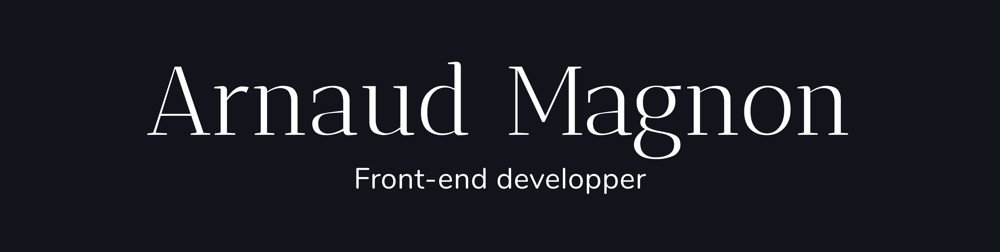

# 🍾 Portfolio



## Front-end project

## ✏️ Description

Development of a personal portfolio to display my different projects. <br/>
Fully responsive website.<br/>
Upload with Vercel

## ⚡️ Overview


## 🔥 Experience

This portfolio allowed me to enhance my skills in design and Front-end development, due to the use of animation library (GreenSock).

## ⚙️ Techno used

   

## 🔧 Install

```
git clone https://github.com/Greepsu/Portfolio
cd Portfolio
npm start
```

## 💻 Links

Portfolio: https://portfolio-greepsu.vercel.app <br/>
Github: https://github.com/Greepsu/Portfolio
